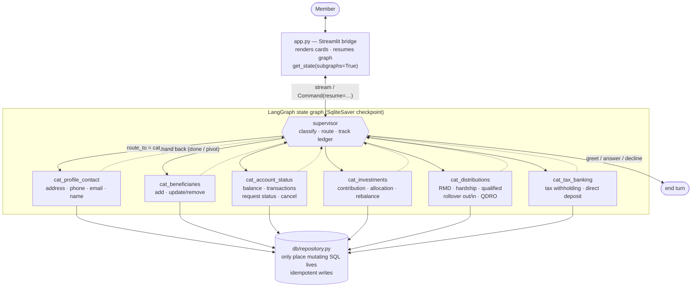
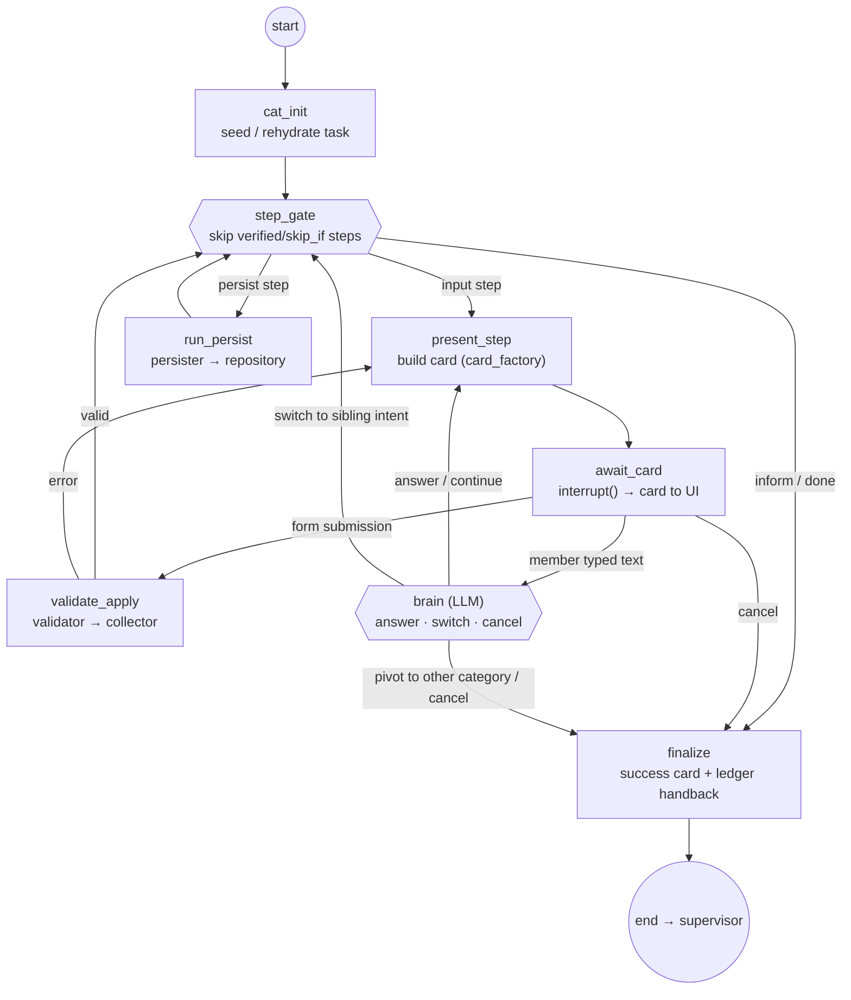
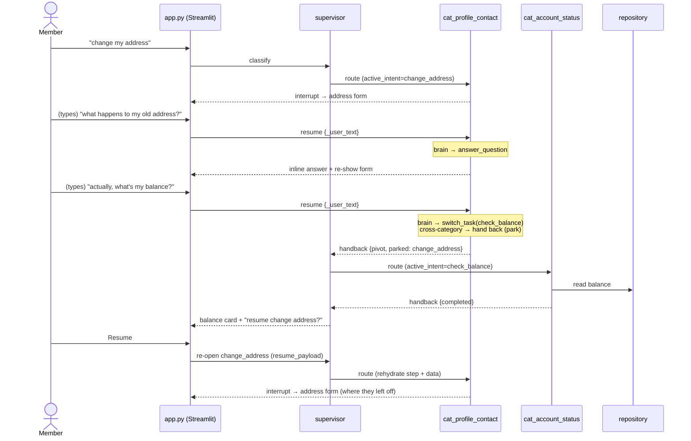

# Architecture — Supervisor + Per-Category Subagents

The retirement-account assistant is a **hybrid multi-agent system** built on LangGraph.
A thin **supervisor** classifies intent and routes; **six category subagents** (one per
retirement-account domain) own the conversation and carry each task to completion. An LLM
drives the conversation, but every data mutation runs through the original validated,
idempotent building blocks — so money operations stay deterministic.

- **Supervisor (orchestrator)** — classify intent / chat / clarify / decline, route to the
  owning category agent, and track a task ledger + the overall ask.
- **Category agent** — owns its domain's intents and domain knowledge; walks each workflow's
  validated steps, answers in-domain questions, switches between sibling tasks, and hands
  back to the supervisor on a cross-category pivot.
- **Bridge** — Streamlit renders the interactive cards a subagent raises via `interrupt()`,
  and resumes the graph with the member's submission (or typed text).

## 1. System topology



The supervisor resolves the **specific** intent (reusing the original `start_workflow` /
`propose_workflow` classification) and routes it to the agent that owns it via
`INTENT_TO_CATEGORY`. Each category agent is one reusable subgraph (`build_category_agent`)
parameterized by a `CategorySpec` — 6 specs, 21 intents.

## 2. Inside a category agent (the subgraph)

The deterministic spine (`present → await → validate → persist`, reused verbatim from the
original node logic) drives every form flow. The LLM **brain** is consulted only when the
member types free text while a card is showing — to answer, switch tasks, or cancel.



**Constraints that keep it safe:** the brain's action space is closed (answer / switch_task /
continue / cancel); it cannot fabricate or skip a validated write — `run_persist` is only
reached by the deterministic spine. A per-task **brain-turn budget** stops any runaway loop.
Validation errors re-render the same card deterministically (the brain is never asked to "fix"
form data).

## 3. A turn with a mid-flow question and a cross-category pivot



## 4. Key design decisions

| Decision | Why |
|---|---|
| **Hybrid execution** (LLM drives, tools execute) | The LLM owns conversation/decisions; mutations go through the original validators + persisters + `repository`, so idempotency and validation are preserved byte-for-byte. |
| **6 category agents, not 21 per-workflow** | Fewer, smarter agents; domain knowledge grouped per domain; common in-domain follow-ups (address → phone) handled by one agent. |
| **Shared vs. private state channels** | `pending_card` / `final_card` / `verified` / `last_handback` are shared (same key name in both state schemas) so cards surface to the bridge; each agent's `cat_messages` scratchpad stays private, keeping the top-level conversation clean. |
| **Context at the right altitude** | Supervisor holds the user conversation + task ledger + overall ask; each subagent holds only its own task context. |
| **Nested-interrupt bridge** | While suspended inside a subgraph, the pending card is read from `snap.tasks` (it has not yet surfaced to the parent); `Command(resume=…)` is delivered to the interrupted subgraph node. |

## File map

| File | Role |
|---|---|
| `agents/graph.py` | Wires the supervisor + 6 category subgraph nodes; shared `SqliteSaver`. |
| `agents/nodes.py` | `supervisor_node` (classify · route · ledger) + shared LLM/message helpers. |
| `agents/categories.py` | The 6 `CategorySpec`s (domain prompts + member intents) + `INTENT_TO_CATEGORY`. |
| `agents/category_agent.py` | `build_category_agent` — the reusable subagent subgraph + brain. |
| `agents/state.py` / `agents/category_state.py` | `OrchestratorState` / `CategoryAgentState` (shared + private channels). |
| `agents/intents.py` | Per-intent step plans + card factories / validators / collectors / persisters (reused). |
| `app.py` | Streamlit ↔ LangGraph bridge (subgraph-aware reads, resume, parked-task resume). |
| `ui/`, `db/`, `data/` | Card models + renderers, SQLite repository, schema + seed. |
```
